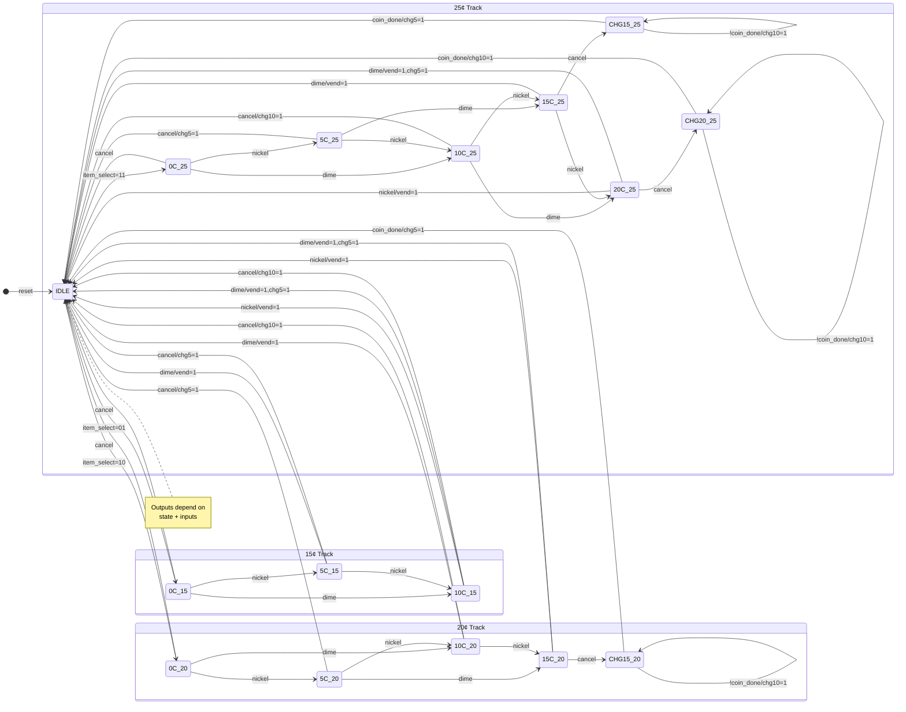
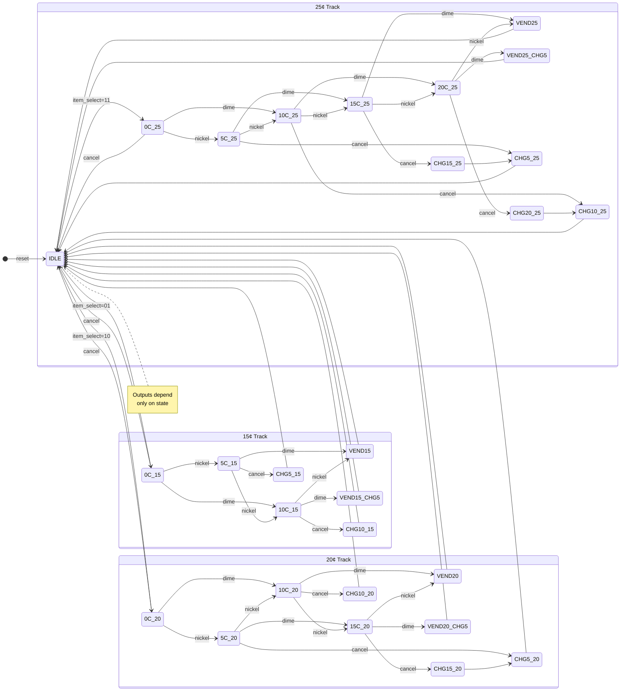

<div align="center">
<h1> 🎰 Advanced Vending Machine Controller - Comprehensive Dual FSM Implementation
</div>

<div align="center">
  
  
  
  
  
  
  
  <h3>A comprehensive comparative study of Mealy and Moore FSM architectures through synthesizable RTL implementation of a multi-item vending machine controller with state-track design methodology</h3>
  
  [Overview](#📋-project-overview) • [Specifications](#🔧-key-specifications) • [Architecture](#🗃️-architecture-design) • [State Machines](#🔄-state-machine-design) • [Performance](#⚡-performance-analysis) • [Usage](#🚀-usage-guide)

  
</div>

---

## 📖 Table of Contents

- [Project Overview](#📋-project-overview)
- [Key Specifications](#🔧-key-specifications)
- [Features](#✨-key-features)
- [Architecture Design](#🗃️-architecture-design)
- [State Machine Design](#🔄-state-machine-design)
- [Performance Analysis](#⚡-performance-analysis)
- [Verification & Testing](#🧪-verification--testing)
- [Usage Guide](#🚀-usage-guide)
- [Design Insights](#💡-design-insights)
- [Repository Structure](#📁-repository-structure)
- [Author](#👨‍💻-author)

---

## 📋 Project Overview

This project presents a **comprehensive comparative implementation** of Mealy and Moore Finite State Machines through a real-world application: a vending machine controller. The design employs a **state-track architectural methodology** where independent state sequences handle different item prices, enabling realistic multi-cycle change dispensing using only actual coin denominations.

**Research Focus:**
- Quantitative comparison of Mealy vs Moore FSM performance
- State-track architecture as a scalable design pattern
- Real-world constraints: actual coin denominations, transaction cancellation, multi-item support
- FPGA implementation validation with measured timing and power metrics

**Key Achievement:**
Both implementations successfully synthesized and implemented on Artix-7 FPGA with **79-81.5 MHz maximum operating frequencies**, demonstrating that design choice between Mealy and Moore architectures involves nuanced trade-offs beyond simple state count comparisons.

---

## 🔧 Key Specifications

| Parameter | Mealy FSM | Moore FSM | Notes |
|-----------|-----------|-----------|-------|
| **Item Prices** | 15¢, 20¢, 25¢ | 15¢, 20¢, 25¢ | Three distinct items |
| **Accepted Coins** | 5¢ (Nickel), 10¢ (Dime) | 5¢ (Nickel), 10¢ (Dime) | Standard US denominations |
| **Total States** | **16 states** | **28 states** | 1.75× more states in Moore |
| **State Encoding** | 4 bits | 5 bits | 1 additional bit required |
| **Max Frequency** | **79.05 MHz** | **81.50 MHz** | Moore 3.1% faster |
| **Setup Slack (WNS)** | +0.077 ns | +0.030 ns | Both timing-safe |
| **Hold Slack (WHS)** | +0.086 ns | +0.086 ns | Both hold-safe |
| **Power Consumption** | **72 mW** | **73 mW** | Mealy 1.4% lower |
| **Slice LUTs** | **24** | **28** | Mealy 14.3% fewer |
| **Slice Registers** | **5** | **5** | Same (state FFs differ) |
| **F7 Muxes** | 4 | 1 | Mealy uses more muxes |
| **F8 Muxes** | 2 | 0 | Mealy only |
| **Bonded IOBs** | 10 | 10 | Same I/O |
| **BUFGCTRL** | 1 | 1 | Same clocking |
| **Output Latency** | Immediate (combinational) | +1 cycle (registered) | Mealy responds faster |
| **Output Stability** | Combinational (may glitch) | Registered (glitch-free) | Moore more stable |
| **Architecture Style** | State-Track | State-Track | Scalable design pattern |
| **Reset Type** | Active-Low Async | Active-Low Async | Immediate initialization |
| **HDL Standard** | Verilog-2001 | Verilog-2001 | Industry standard |

---

## ✨ Key Features

**Dual FSM Implementation:**
- Complete Mealy and Moore versions with identical functionality
- Direct performance comparison under identical conditions
- Educational value: demonstrates fundamental FSM design principles

**State-Track Architecture:**
- Independent state sequences for each item price (15¢, 20¢, 25¢)
- Each track maintains its own multi-cycle change states (no state sharing between tracks)
- Scalable design: adding new items requires only new tracks
- Clear separation of concerns improves maintainability and debugging

**Realistic Operation:**
- Multi-cycle change dispensing using only actual denominations (5¢, 10¢)
- No abstract coins: 15¢ refund = 10¢ → 5¢ sequence over 2 cycles
- 20¢ refund = 10¢ → 10¢ sequence over 2 cycles
- Transaction cancellation with complete refund at any state

**Production-Ready Design:**
- Strict two-process FSM methodology
- Complete case coverage with default assignments
- Zero latch inference verified through synthesis
- Timing closure with positive slack margins

**Comprehensive Verification:**
- Unified testbench validates both implementations
- 17 test scenarios covering all item combinations
- Simulation duration: 2125 ns covering all test cases
- Waveform analysis confirms correct multi-cycle behavior

---

## 🗃️ Architecture Design

### State-Track Methodology (Mealy FSM)

The **state-track architecture** branches into independent tracks for each item price. In Mealy FSM, **outputs are combinational** and generated immediately based on current state + inputs.
```
                             S_IDLE
                     (Item Selection Point)
                               |
         +---------------------+---------------------+
         |                     |                     |
     Select 15¢            Select 20¢            Select 25¢
         |                     |                     |
         v                     v                     v
┌─────────────────┐  ┌───────────────────┐  ┌───────────────────┐
│    15¢ TRACK    │  │     20¢ TRACK     │  │     25¢ TRACK     │
│    (3 states)   │  │     (5 states)    │  │     (7 states)    │
├─────────────────┤  ├───────────────────┤  ├───────────────────┤
│    S_0C_15C     │  │     S_0C_20C      │  │     S_0C_25C      │
│        ↓        │  │         ↓         │  │         ↓         │
│    S_5C_15C     │  │     S_5C_20C      │  │     S_5C_25C      │
│        ↓        │  │         ↓         │  │         ↓         │
│    S_10C_15C    │  │     S_10C_20C     │  │     S_10C_25C     │
│                 │  │         ↓         │  │         ↓         │
│                 │  │     S_15C_20C     │  │     S_15C_25C     │
│                 │  │         ↓         │  │         ↓         │
│                 │  │ S_CHANGE_15C_20C* │  │     S_20C_25C     │
│                 │  │                   │  │         ↓         │
│                 │  │                   │  │ S_CHANGE_15C_25C* │
│                 │  │                   │  │         ↓         │
│                 │  │                   │  │ S_CHANGE_20C_25C* │
│                 │  │                   │  │                   │
│                 │  │   *Multi-cycle    │  │   *Multi-cycle    │
│                 │  │   refund state    │  │   refund state    │
└────────┬────────┘  └─────────┬─────────┘  └─────────┬─────────┘
         |                     |                      |
         +---------------------+----------------------+
                               |
                   All tracks return to S_IDLE
```

### State-Track Methodology (Moore FSM)

The **state-track architecture** branches into independent tracks for each item price. In Moore FSM, **outputs depend only on state** and require dedicated output states.
```
                                   S_IDLE
                           (Item Selection Point)
                                     |
           +-------------------------+------------------------+
           |                         |                        |
       Select 15¢                Select 20¢               Select 25¢
           |                         |                        |
           v                         v                        v
┌──────────────────────┐  ┌──────────────────────┐  ┌──────────────────────┐
│      15¢ TRACK       │  │      20¢ TRACK       │  │     25¢ TRACK        │
│      (3 states)      │  │      (5 states)      │  │     (7 states)       │
├──────────────────────┤  ├──────────────────────┤  ├──────────────────────┤
│      S_0C_15C        │  │      S_0C_20C        │  │      S_0C_25C        │
│          ↓           │  │          ↓           │  │          ↓           │
│      S_5C_15C        │  │      S_5C_20C        │  │      S_5C_25C        │
│          ↓           │  │          ↓           │  │          ↓           │
│      S_10C_15C       │  │      S_10C_20C       │  │      S_10C_25C       │
│          ↓           │  │          ↓           │  │          ↓           │
│      S_15C_15C       │  │      S_15C_20C       │  │      S_15C_25C       │
│          ↓           │  │          ↓           │  │          ↓           │
│   S_CHANGE_5C_15C    │  │      S_20C_20C       │  │      S_20C_25C       │
│          ↓           │  │          ↓           │  │          ↓           │  
│   S_CHANGE_10C_15C   │  │   S_CHANGE_5C_20C    │  │      S_25C_25C       │
│          ↓           │  │          ↓           │  │          ↓           │
│ S_CHANGE_5C_VEND_15C │  │   S_CHANGE_10C_20C   │  │   S_CHANGE_5C_25C    │
│                      │  │          ↓           │  │          ↓           │
│                      │  │   S_CHANGE_15C_20C   │  │   S_CHANGE_10C_25C   │
│                      │  │          ↓           │  │          ↓           │
│                      │  │ S_CHANGE_5C_VEND_20C │  │   S_CHANGE_15C_25C   │
│                      │  │                      │  │          ↓           │
│                      │  │                      │  │   S_CHANGE_20C_25C   │
│                      │  │                      │  │          ↓           │
│                      │  │                      │  │ S_CHANGE_5C_VEND_25C │
└──────────┬───────────┘  └───────────┬──────────┘  └──────────┬───────────┘
           |                          |                        |
           +--------------------------+------------------------+
                                      |
                         All tracks return to S_IDLE
```

**Track Characteristics:**
- **Isolation:** Each track operates independently with its own multi-cycle change states
- **Money Accumulation:** Tracks maintain accumulated coins specific to selected item
- **Exit Conditions:** Vend (sufficient money) or Cancel (refund and return to IDLE)

### Module Interfaces

Both FSMs share identical interfaces for direct comparison:

```verilog
module vending_machine_mealy/moore(
    // Clock and Reset
    input  wire       clk,          // System clock
    input  wire       rst,          // Active-low asynchronous reset
    
    // User Inputs
    input  wire       nickel,       // 5¢ coin insertion pulse
    input  wire       dime,         // 10¢ coin insertion pulse
    input  wire       cancel,       // Transaction cancellation
    input  wire [1:0] item_select,  // 01=15¢, 10=20¢, 11=25¢
    
    // Outputs
    output reg        vend,         // Item dispense signal
    output reg        change_5C,    // 5¢ coin return
    output reg        change_10C    // 10¢ coin return
);
```

**Timing Protocol:**
- All inputs sampled on rising edge of `clk`
- **Mealy outputs:** Change combinationally in same cycle when inputs change state transitions
- **Moore outputs:** Change only after state register updates (next cycle after inputs cause transition)
- Multi-cycle operations: Change outputs remain active across multiple clock cycles
- Reset: active-low; immediately returns FSM to S_IDLE

**Key Difference - Output Timing:**

| FSM Type | Output Behavior | Latency |
|----------|----------------|---------|
| **Mealy** | Outputs depend on current state + inputs; change combinationally when inputs arrive | **0 additional cycles** - immediate response to input changes |
| **Moore** | Outputs depend only on current state; change only after state register clocked | **+1 cycle** - must wait for state update before output changes |

---

## 🔄 State Machine Design

### Mealy FSM (16 States)

**State Breakdown:**

| State Category | Count | State Names | Encodings |
|---------------|-------|-------------|-----------|
| **Idle** | 1 | `S_IDLE` | `4'b0000` |
| **15¢ Track** | 3 | `S_0C_15C`, `S_5C_15C`, `S_10C_15C` | `4'b0001`, `4'b0010`, `4'b0011` |
| **20¢ Track** | 5 | `S_0C_20C`, `S_5C_20C`, `S_10C_20C`, `S_15C_20C`, `S_CHANGE_15C_20C` | `4'b0100`-`4'b0111`, `4'b1000` |
| **25¢ Track** | 7 | `S_0C_25C`, `S_5C_25C`, `S_10C_25C`, `S_15C_25C`, `S_20C_25C`, `S_CHANGE_15C_25C`, `S_CHANGE_20C_25C` | `4'b1001`-`4'b1101`, `4'b1110`, `4'b1111` |
| **Total** | **16** | | **4-bit encoding** |


### Mealy FSM State Transition Diagram



### Moore FSM (28 States)

**State Breakdown:**

| State Category | Count | State Names | Encodings |
|---------------|-------|-------------|-----------|
| **Idle** | 1 | `S_IDLE` | `5'b00000` |
| **15¢ Track** | 7 | `S_0C_15C`, `S_5C_15C`, `S_10C_15C`, `S_15C_15C`, `S_CHANGE_5C_15C`, `S_CHANGE_10C_15C`, `S_CHANGE_5C_VEND_15C` | `5'b00001`-`5'b00111` |
| **20¢ Track** | 9 | `S_0C_20C`, `S_5C_20C`, `S_10C_20C`, `S_15C_20C`, `S_20C_20C`, `S_CHANGE_5C_20C`, `S_CHANGE_10C_20C`, `S_CHANGE_15C_20C`, `S_CHANGE_5C_VEND_20C` | `5'b01000`-`5'b10000` |
| **25¢ Track** | 11 | `S_0C_25C`, `S_5C_25C`, `S_10C_25C`, `S_15C_25C`, `S_20C_25C`, `S_25C_25C`, `S_CHANGE_5C_25C`, `S_CHANGE_10C_25C`, `S_CHANGE_15C_25C`, `S_CHANGE_20C_25C`, `S_CHANGE_5C_VEND_25C` | `5'b10001`-`5'b11011` |
| **Total** | **28** | | **5-bit encoding** |

### Moore FSM State Transition Diagram



---

## ⚡ Performance Analysis

### Timing Performance

**Achieved Maximum Frequencies:**

| FSM Type | Clock Period | Max Frequency | Setup Slack (WNS) | Hold Slack (WHS) | Status |
|----------|--------------|---------------|-------------------|------------------|--------|
| **Mealy** | **12.66 ns** | **79.05 MHz** | +0.077 ns | +0.086 ns | ✅ Met |
| **Moore** | **12.27 ns** | **81.50 MHz** | +0.030 ns | +0.086 ns | ✅ Met |

**Key Findings:**

1. **Moore is 3.1% Faster:** Despite having 75% more states, Moore FSM achieved higher maximum frequency
   - **Why?** Simpler combinational logic paths in Moore (outputs depend only on state, not inputs)
   - **Critical Path:** Mealy has longer combinational paths from inputs through state decode to outputs

2. **Both Meet Timing:** Positive slack margins confirm both designs are timing-safe
   - Mealy: Comfortable margin (+0.077ns setup, +0.086ns hold)
   - Moore: Tighter setup but still safe (+0.030ns setup, +0.086ns hold)

### Power Consumption

**Measured Power (Post-Implementation):**

| FSM Type | Total Power | Dynamic | Device Static | Junction Temp |
|----------|-------------|---------|---------------|---------------|
| **Mealy** | **72 mW** | 1 mW (2%) | 70 mW (98%) | 25.4°C |
| **Moore** | **73 mW** | 3 mW (4%) | 70 mW (96%) | 25.4°C |

**Key Findings:**

1. **Mealy Consumes 1.4% Less Power:** 72mW vs 73mW
2. **Static Power Dominates:** 96-98% of total power is leakage
3. **Dynamic Power Difference:** Mealy uses 67% less dynamic power (1mW vs 3mW)

### Comparative Metrics Table

| Metric | Mealy FSM | Moore FSM | Difference | Winner |
|--------|-----------|-----------|------------|--------|
| **Architecture** |
| Total States | 16 | 28 | +75% | Mealy ✓ |
| State Encoding | 4 bits | 5 bits | +1 bit | Mealy ✓ |
| **Timing** |
| Max Frequency | 79.05 MHz | 81.50 MHz | +3.1% | Moore ✓ |
| Setup Slack | +0.077 ns | +0.030 ns | -0.047 ns | Mealy ✓ |
| Hold Slack | +0.086 ns | +0.086 ns | Same | Tie |
| **Resources** |
| Slice LUTs | **24** | **28** | +16.7% | Mealy ✓ |
| Slice Registers | **5** | **5** | Same | Tie |
| F7 Muxes | 4 | 1 | -75% | Moore ✓ |
| F8 Muxes | 2 | 0 | -100% | Moore ✓ |
| Bonded IOBs | 10 | 10 | Same | Tie |
| BUFGCTRL | 1 | 1 | Same | Tie |
| **Power** |
| Total Power | 72 mW | 73 mW | +1.4% | Mealy ✓ |
| Dynamic Power | 1 mW | 3 mW | +200% | Mealy ✓ |
| **Functional** |
| Output Response | Immediate (combinational) | +1 cycle (registered) | Faster | Mealy ✓ |
| Output Stability | May glitch | Glitch-free | More stable | Moore ✓ |

**Scorecard:**
- **Mealy Advantages:** 8 metrics (resources, power, response time, state count, setup slack)
- **Moore Advantages:** 4 metrics (frequency, output stability, fewer complex muxes)
- **Tied:** 4 metrics

---

## 🧪 Verification & Testing

### Comprehensive Test Scenarios

**17 Test Cases** covering all functional requirements:

| Category | Tests | Coverage |
|----------|-------|----------|
| 15¢ Item Tests | 4 | Exact payment (3 ways) + overpayment |
| 20¢ Item Tests | 3 | Exact payment (2 ways) + overpayment |
| 25¢ Item Tests | 3 | Exact payment (2 ways) + overpayment |
| Simple Cancels | 3 | Cancel with 0¢, 5¢, 10¢ |
| Multi-Cycle Cancels | 2 | Cancel with 15¢, 20¢ (sequences) |
| Edge Cases | 2 | No selection, mid-transaction change |
| **Total** | **17** | Full functional coverage |

### Simulation Results

**Test Execution:**
- **Total Simulation Time:** 2125 ns (2.125 μs)
- **All Tests Passed:** ✅ 17/17 for both Mealy and Moore
- **Waveform Coverage:** Complete verification captured in simulation screenshots

**Sample Output from Terminal:**

```
=== Vending Machine Test Started ===

Test 1: 15c Item - Nickel + Dime = Exact Amount
Time=85000 | State=0010 | vend=1 change_5C=0 change_10C=0
  >>> Item dispensed (exact amount)

Test 14: Select 25c Item, Insert Dime + Nickel, then Cancel
Time=1665000 | State=1110 | vend=0 change_5C=0 change_10C=1
  >>> 10c returned (cancelled)
Time=1675000 | State=1110 | vend=0 change_5C=1 change_10C=0
  >>> 5c returned (cancelled)

=== All Tests Completed ===
```

**Multi-Cycle Verification:**
- Test 14: 15¢ refund correctly dispensed as 10¢ (cycle 1) → 5¢ (cycle 2)
- Test 15: 20¢ refund correctly dispensed as 10¢ (cycle 1) → 10¢ (cycle 2)

---

## 🚀 Usage Guide

### Prerequisites

**Software Tools:**
- **Icarus Verilog + GTKWave** (open-source simulation and waveform viewing)
- **Xilinx Vivado** (synthesis, implementation, and FPGA programming)

### Clone Repository
```bash
git clone https://github.com/AyushVerma17/advanced-vending-machine-rtl.git
# make sure you are in the directory: advanced-vending-mahcine-rtl
```

### Using Icarus Verilog

**Testing Mealy FSM:**
```bash
# Compile
iverilog -o vend_mealy vending_machine_mealy.v vending_machine_tb.v

# Run
vvp vend_mealy

# View waveforms
gtkwave vending_machine.vcd &
```

**Testing Moore FSM:**
```bash
# Edit vending_machine_tb.v line ~18 to instantiate moore instead of mealy
# Compile
iverilog -o vend_moore vending_machine_moore.v vending_machine_tb.v

# Run
vvp vend_moore

# View waveform
gtkwave vending_machine.vcd &
```

### Using Vivado

**Create Project:**
```tcl
# 📁 Create project
create_project -> advanced_vending_machine -> RTL Project
Parts -> Artix-7 -> xc7a35tcpg236-1

# ➕ Add sources (choose Mealy OR Moore)
Add Sources -> Add or create design sources -> vending_machine_mealy.v (or moore)
Add Sources -> Add or create simulation sources -> vending_machine_tb.v
# (Edit testbench to instantiate melay or moore module)
Add Sources -> Add or create constraints -> constraints.xdc
```

**Clock constraint**
```tcl
# 📝 Add timing constraints to constraints.xdc:
# Clock creation
create_clock -period 12.66 [get_ports clk]

# Input delays
set_input_delay -clock [get_clocks clk] 2.0 [get_ports {nickel dime cancel rst}]
set_input_delay -clock [get_clocks clk] 2.0 [get_ports item_select[*]]

# Output delays  
set_output_delay -clock [get_clocks clk] 2.0 [get_ports {vend change_5C change_10C}]

```

**Run Synthesis & Implementation:**
```tcl

# 👁️ RTL Analysis
RTL ANALYSIS -> Open Elaborated Design  

# ▶️ Run simulation
SIMULATION -> Run Simulation -> Run Behavioral Simulation

# 🔧 Complete FPGA Implementation Flow
SYNTHESIS -> Run Synthesis
IMPLEMENTATION -> Run Implementation

# 📊 Generate reports
Reports -> Timing Summary, Utilization, Power Analysis
Layout -> Device -> View implementation details

```
---

## 💡 Design Insights

### Application-Specific Recommendations

| Application Domain | Recommendation | Primary Reason |
|-------------------|----------------|----------------|
| **Real-time control** | Mealy | Immediate response (0 cycles) |
| **Safety-critical** | Moore | Glitch-free registered outputs |
| **High-speed protocols** | Mealy | Faster response time |
| **Pipeline designs** | Moore | Higher max frequency |
| **Resource-limited** | Mealy | 14% fewer LUTs |
| **Power-sensitive** | Mealy | 67% less dynamic power |
| **Easy debugging** | Moore | Clear state-output relationship |
| **General purpose** | Moore | More stable, slightly faster |

---

## 📁 Repository Structure

```
advanced-vending-machine-rtl/
│
├── 📄 vending_machine_mealy.v           # Mealy FSM (16 states, 4-bit)
├── 📄 vending_machine_moore.v           # Moore FSM (28 states, 5-bit)
├── 📄 vending_machine_tb.v              # Unified testbench (17 tests)
│
├── 📄 constraints.sdc                   # SDC timing constraints
│
├── 📊 Simulation Results/
│   ├── Behavioral_Simulation_1.png     # Waveform part 1
│   └── Behavioral_Simulation_2.png     # Waveform part 2 
│
├── Mealy_Implementation/
│   ├── Utilization_Report.png      # 24 LUTs, 5 FFs
│   ├── Power_Summary.png           # 72mW power
│   ├── Timing_Summary.png          # 79.05MHz
│   ├── RTL_Schematic.pdf           # RTL view
│   └── Synthesized_Schematic.pdf   # Gate-level view
│   
├── Moore_Implementation/
│   ├── Utilization_Report.png      # 28 LUTs, 5 FFs
│   ├── Power_Summary.png           # 73mW power
│   ├── Timing_Summary.png          # 81.5MHz
│   ├── RTL_Schematic.pdf           # RTL view
│   └── Synthesized_Schematic.pdf   # Gate-level view
│
├── README.md                       # This file
│
└── 📜 LICENSE                      # MIT License
```

---

## 👨‍💻 Author

**Ayush Verma**  
B.Tech ECE, VIT Vellore, Tamil Nadu, India  
Email: ayushverma.ayuv@gmail.com

<a href="https://github.com/AyushVerma17">
  
</a>
<a href="https://www.linkedin.com/in/ayushverma/?utm_source=share&utm_campaign=share_via&utm_content=profile&utm_medium=ios_app">
  
</a>

---

<div align="center">

### 🌟 Found this project useful? Give it a star!

*Designed with passion for digital design excellence*

</div>