# 🎰 Advanced Vending Machine Controller - Multi-Item Mealy FSM Implementation

<div align="center">
  
  
  
  
  
  
  <h3>A synthesizable RTL design of an advanced multi-item vending machine controller with realistic change dispensing</h3>
  
  [Features](#✨-features) • [Architecture](#🗗️-architecture) • [State Machine](#🔄-state-machine-design) • [Simulation](#🧪-simulation) • [FPGA Results](#fpga-implementation-results-artix-7-xc7a35tcpg236-1) • [Usage](#🚀-usage) • [Author](#👨‍💻-author)


</div>

---

## 📖 Table of Contents

- [Project Overview](#-project-overview)
- [Key Specifications](#-key-specifications)
- [Features](#-features)
- [Architecture](#-architecture)
  - [Module Interface](#module-interface)
  - [RTL Implementation Highlights](#rtl-implementation-highlights)
- [State Machine Design](#-state-machine-design)
  - [State Transition Diagram](#state-transition-diagram)
  - [State Transition Table](#state-transition-table)
- [Repository Structure](#-repository-structure)
- [Simulation](#-simulation)
  - [Test Scenarios](#test-scenarios)
  - [Simulation Results Preview](#simulation-results-preview)
- [FPGA Implementation Results](#fpga-implementation-results-artix-7-xc7a35tcpg236-1)
  - [Resource Utilization](#resource-utilization)
  - [Timing Analysis](#timing-analysis)
  - [Power Consumption](#power-consumption)
  - [Implementation Visuals](#implementation-visuals)
- [Usage](#-usage)
  - [Prerequisites](#prerequisites)
  - [Quick Start](#quick-start)
  - [Synthesis Guidelines](#synthesis-guidelines)
- [Design Highlights](#-design-highlights)
  - [Why This Implementation Stands Out](#why-this-implementation-stands-out)
  - [Technical Excellence](#technical-excellence)
- [Author](#-author)

---

## 📋 Project Overview

This project implements a **fully synthesizable advanced vending machine controller** using Verilog HDL, designed as an enhanced Mealy Finite State Machine (FSM). The controller manages multiple item types, coin acceptance, intelligent change calculation, and transaction cancellation with robust state management and realistic change dispensing using only actual coin denominations.

## 📋 Key Specifications

| Parameter | Value / Type |
| :--- | :--- |
| **Item Prices** | 15¢, 20¢, 25¢ |
| **Accepted Coins** | Nickel (5¢), Dime (10¢) |
| **FSM Architecture** | 8-State Hybrid Mealy Machine |
| **State Bits** | 3 (`[2:0]`) |
| **Item Selection** | 2-bit input (`[1:0]`) |
| **Reset Type** | Active-Low Asynchronous |
| **Change Dispensing** | Realistic multi-cycle for complex amounts |
| **HDL Standard** | Verilog-2001 |

## ✨ Features

- **Multi-Item Support:** Handles three different item prices (15¢, 20¢, 25¢) with intelligent item selection logic
- **Hybrid Performance:** Simple transactions complete in single cycle, complex change dispensing uses realistic multi-cycle sequences
- **Realistic Change Dispensing:** Uses only actual coin denominations (5¢ and 10¢) - no abstract "15¢ coins"
- **Robust & Synthesizable:** Written in strict two-process style with complete case coverage and default assignments
- **Smart Change Logic:** Automatically handles all overpayment scenarios with optimal change calculation
- **Full Transaction Control:** Dedicated cancel input with complete refund capability for any transaction state
- **Item Selection Memory:** Latches selected item - user doesn't need to hold selection throughout transaction
- **Comprehensive Verification:** Extensive testbench covering all item combinations, overpayment scenarios, and edge cases

## 🏗️ Architecture

### Module Interface

```verilog
module vending_machine_hybrid(
  input  wire       clk,          // System clock
  input  wire       rst,          // Active-low async reset
  input  wire       nickel,       // 5¢ coin insert signal
  input  wire       dime,         // 10¢ coin insert signal
  input  wire       cancel,       // Transaction cancel
  input  wire [1:0] item_select,  // Item selection: 01=15¢, 10=20¢, 11=25¢
  output reg        vend,         // Item dispense signal
  output reg        change_5C,    // 5¢ change return
  output reg        change_10C    // 10¢ change return
);
```

### RTL Implementation Highlights

The design follows industry-standard hybrid FSM methodology:

1. **Sequential Process**: State and item registers updated on clock edge
2. **Combinational Process**: Next-state and output logic with item-aware decisions
3. **Hybrid Approach**: Simple cases immediate, complex cases multi-cycle
4. **Realistic Hardware**: Only dispenses actual coin denominations
5. **Complete Coverage**: All state transitions and edge cases handled

## 🔄 State Machine Design

### State Transition Diagram

```mermaid
stateDiagram-v2
    direction TB
    
    [*] --> S_IDLE : !rst
    
    S_IDLE --> S_0C : item_select[15¢/20¢/25¢]/000
    S_IDLE --> S_IDLE : item_select[NONE]/000
    
    S_0C --> S_5C : N/000
    S_0C --> S_10C : D/000
    S_0C --> S_IDLE : C/000
    
    S_5C --> S_10C : N/000
    S_5C --> S_15C : D & !15¢/000
    S_5C --> S_IDLE : D & 15¢/100
    S_5C --> S_IDLE : C/010
    
    S_10C --> S_15C : N & !15¢/000
    S_10C --> S_IDLE : N & 15¢/100
    S_10C --> S_20C : D & !15¢ & !20¢/000
    S_10C --> S_IDLE : D & 15¢/110
    S_10C --> S_IDLE : D & 20¢/100
    S_10C --> S_IDLE : C/001
    
    S_15C --> S_20C : N & !20¢/000
    S_15C --> S_IDLE : N & 20¢/100
    S_15C --> S_IDLE : D & 20¢/110
    S_15C --> S_IDLE : D & 25¢/100
    S_15C --> S_CHANGE_15C : C
    
    S_20C --> S_IDLE : N/100
    S_20C --> S_IDLE : D/110
    S_20C --> S_CHANGE_20C : C
    
    S_CHANGE_15C --> S_CHANGE_15C : First_Cycle/001
    S_CHANGE_15C --> S_IDLE : Second_Cycle/010
    
    S_CHANGE_20C --> S_CHANGE_20C : First_Cycle/001
    S_CHANGE_20C --> S_IDLE : Second_Cycle/001

    note right of S_IDLE
        Item selection state
        Registers selected item
    end note
    
    note right of S_CHANGE_15C
        Dispenses 10¢ then 5¢
    end note
    
    note right of S_CHANGE_20C
        Dispenses 10¢ then 10¢
    end note
```



### State Transition Table

| Present State `ps[2:0]` | Active Input | Condition (`selected_item`) | Next State `ns[2:0]` | Outputs {`vend, change_5C, change_10C`} |
| :---: | :---: | :---: | :---: | :---: |
| `3'b000` (**S_IDLE**) | `item_select` = `2'b01/10/11` | — | `3'b001` (**S_0C**) | `3'b000` |
| `3'b001` (**S_0C**) | `nickel` | — | `3'b010` (**S_5C**) | `3'b000` |
| `3'b001` (**S_0C**) | `dime` | — | `3'b011` (**S_10C**) | `3'b000` |
| `3'b001` (**S_0C**) | `cancel` | — | `3'b000` (**S_IDLE**) | `3'b000` |
| `3'b010` (**S_5C**) | `nickel` | — | `3'b011` (**S_10C**) | `3'b000` |
| `3'b010` (**S_5C**) | `dime` | **ITEM_15C** | `3'b000` (**S_IDLE**) | `3'b100` |
| `3'b010` (**S_5C**) | `dime` | Not **ITEM_15C** | `3'b100` (**S_15C**) | `3'b000` |
| `3'b010` (**S_5C**) | `cancel` | — | `3'b000` (**S_IDLE**) | `3'b010` |
| `3'b011` (**S_10C**) | `nickel` | **ITEM_15C** | `3'b000` (**S_IDLE**) | `3'b100` |
| `3'b011` (**S_10C**) | `nickel` | Not **ITEM_15C** | `3'b100` (**S_15C**) | `3'b000` |
| `3'b011` (**S_10C**) | `dime` | **ITEM_15C** | `3'b000` (**S_IDLE**) | `3'b110` |
| `3'b011` (**S_10C**) | `dime` | **ITEM_20C** | `3'b000` (**S_IDLE**) | `3'b100` |
| `3'b011` (**S_10C**) | `dime` | **ITEM_25C** | `3'b101` (**S_20C**) | `3'b000` |
| `3'b011` (**S_10C**) | `cancel` | — | `3'b000` (**S_IDLE**) | `3'b001` |
| `3'b100` (**S_15C**) | `nickel` | **ITEM_20C** | `3'b000` (**S_IDLE**) | `3'b100` |
| `3'b100` (**S_15C**) | `nickel` | **ITEM_25C** | `3'b101` (**S_20C**) | `3'b000` |
| `3'b100` (**S_15C**) | `dime` | **ITEM_20C** | `3'b000` (**S_IDLE**) | `3'b110` |
| `3'b100` (**S_15C**) | `dime` | **ITEM_25C** | `3'b000` (**S_IDLE**) | `3'b100` |
| `3'b100` (**S_15C**) | `cancel` | — | `3'b110` (**S_CHANGE_15C**) | `3'b000` |
| `3'b101` (**S_20C**) | `nickel` | **ITEM_25C** | `3'b000` (**S_IDLE**) | `3'b100` |
| `3'b101` (**S_20C**) | `dime` | **ITEM_25C** | `3'b000` (**S_IDLE**) | `3'b110` |
| `3'b101` (**S_20C**) | `cancel` | — | `3'b111` (**S_CHANGE_20C**) | `3'b000` |
| `3'b110` (**S_CHANGE_15C**) | **Cycle 1** | — | `3'b110` (**S_CHANGE_15C**) | `3'b001` |
| `3'b110` (**S_CHANGE_15C**) | **Cycle 2** | — | `3'b000` (**S_IDLE**) | `3'b010` |
| `3'b111` (**S_CHANGE_20C**) | **Cycle 1** | — | `3'b111` (**S_CHANGE_20C**) | `3'b001` |
| `3'b111` (**S_CHANGE_20C**) | **Cycle 2** | — | `3'b000` (**S_IDLE**) | `3'b001` |

*Note: The table assumes only one input is active at a time.

*Output format: `{vend, change_5C, change_10C}`*

## 📁 Repository Structure

```
advanced-vending-machine-rtl/
│
├── 📄 vending_machine_mealy.v          # Main RTL module
├── 📄 vending_machine_mealy_tb.v       # Comprehensive testbench
├── 📄 constraints.sdc                  # Timing constraints file
├── 📄 rtl_schematic.pdf                # RTL schematic view
├── 📄 synthesized_schematic.pdf        # Post-synthesis schematic
├── 📄 Power_Summary.png                # Power consumption report
├── 📄 Timing_Summary.png               # Timing report
├── 📄 Behavioral_Simulation.png        # Simulation waveforms
├── 📄 fpga_floorplan_overview.png      # Complete FPGA floorplan
├── 📄 fpga_floorplan_detailed.png      # Detailed placement view
├── 📄 fpga_slice_implementation.png    # Slice-level implementation
└── 📄 README.md                        # This documentation
```

## 🧪 Simulation

### Test Scenarios

The testbench validates comprehensive operational scenarios across all item types:

| Test Category | Description | Input Sequence | Expected Output |
|---------------|-------------|----------------|-----------------|
| **15¢ Item Tests** | Exact payment (N+D) | Select 15¢ → 5¢ → 10¢ | Vend item |
| | Exact payment (D+N) | Select 15¢ → 10¢ → 5¢ | Vend item |
| | Overpayment | Select 15¢ → 10¢ → 10¢ | Vend + 5¢ change |
| **20¢ Item Tests** | Exact payment (D+D) | Select 20¢ → 10¢ → 10¢ | Vend item |
| | Exact payment (D+2N) | Select 20¢ → 10¢ → 5¢ → 5¢ | Vend item |
| | Overpayment | Select 20¢ → 10¢ → 10¢ → 5¢ | Vend + 5¢ change |
| **25¢ Item Tests** | Exact payment (2D+N) | Select 25¢ → 10¢ → 10¢ → 5¢ | Vend item |
| | Overpayment | Select 25¢ → 10¢ → 10¢ → 10¢ | Vend + 5¢ change |
| **Simple Cancels** | Cancel with 5¢ | 5¢ → Cancel | Return 5¢ immediately |
| | Cancel with 10¢ | 10¢ → Cancel | Return 10¢ immediately |
| **Multi-Cycle Cancels** | Cancel with 15¢ | 15¢ → Cancel | Return 10¢ → 5¢ sequence |
| | Cancel with 20¢ | 20¢ → Cancel | Return 10¢ → 10¢ sequence |
| **Edge Cases** | No item selection | Insert coins | Coins ignored |
| | Mid-transaction select | Change selection | Original maintained |

### Simulation Results Preview

```
=== Vending Machine Test Started ===
Items: 15c (01), 20c (10), 25c (11)

Test 1: 15c Item - Nickel + Dime = Exact Amount
 <>Selecting 15 cent item...
 <>Inserting Nickel (5c)...
Time=275 | State=010 | Item=01 | vend=0 change_5C=0 change_10C=0
 <>Inserting Dime (10c)...
Time=315 | State=000 | Item=00 | vend=1 change_5C=0 change_10C=0
  >>> Item dispensed (exact amount)

Test 4: 15c Item - Dime + Dime = 20c (expect 5c change)
 <>Inserting Dime (10c)...
 <>Inserting Dime (10c)...
Time=435 | State=000 | Item=00 | vend=1 change_5C=1 change_10C=0
  >>> Item dispensed with 5c change

Test 14: Select 25c Item, Insert Dime + Nickel, then Cancel
 <>Pressing Cancel...
Time=1665 | State=110 | Item=00 | vend=0 change_5C=0 change_10C=1
  >>> 10c returned (cancelled)
Time=1675 | State=110 | Item=00 | vend=0 change_5C=1 change_10C=0
  >>> 5c returned (cancelled)
```

## FPGA Implementation Results (Artix-7 xc7a35tcpg236-1)

### Resource Utilization
| Resource | Used | Available | Utilization % |
|----------|------|-----------|---------------|
| Slice LUTs | 24 | 20,800 | 0.115% |
| Slice Registers | 6 | 41,600 | 0.014% |
| Bonded IOB | 10 | 106 | 9.433% |
| BUFGCTRL | 1 | 32 | 3.13% |

### Timing Analysis  
| Parameter | Value | Status |
|-----------|--------|---------|
| Target Frequency | 76.335 MHz | ✅ Met |
| Setup Slack (WNS) | +2.504 ns | ✅ Positive |
| Hold Slack (WHS) | +0.160 ns | ✅ Positive |

### Power Consumption
| Parameter | Value |
|-----------|--------|
| Total On-Chip Power | 71 mW |
| Dynamic Power | 1 mW (2%) |
| Static Power | 70 mW (98%) |
| Junction Temperature | 25.4°C |

### Implementation Visuals
- **RTL/Synthesized Schematics**: Show the enhanced logical design with item selection and multi-cycle change logic
- **Power Analysis**: Demonstrates efficient operation (74mW total) despite increased functionality
- **FPGA Floorplan**: Physical placement visualization showing optimized resource utilization
- **Slice Implementation**: Detailed view of LUT and flip-flop usage for the expanded state machine

## 🚀 Usage

### Prerequisites

- Verilog simulator (Icarus Verilog, ModelSim, Vivado, VCS)
- GTKWave or similar waveform viewer (optional)
- Synthesis tool for FPGA/ASIC implementation (optional)

### Quick Start

#### Using Icarus Verilog (Open Source)

```bash
# Clone the repository
git clone https://github.com/AyushVerma17/advanced-vending-machine-rtl.git
cd advanced-vending-machine-rtl

# Compile the design
iverilog -o vend_hybrid vending_machine_hybrid.v vending_machine_hybrid_tb.v

# Run simulation
vvp vend_hybrid

# View waveforms (optional)
gtkwave vending_machine.vcd &
```

#### Using ModelSim/QuestaSim

```tcl
# Create work library
vlib work

# Compile sources
vlog vending_machine_hybrid.v vending_machine_hybrid_tb.v

# Start simulation
vsim -novopt work.vending_machine_hybrid_tb

# Add signals to waveform
add wave -recursive *

# Run simulation
run -all
```

### Using Vivado

```tcl
# 📁 Create project
create_project -> advanced_vending_machine -> RTL Project
Parts -> Artix-7 -> xc7a35tcpg236-1

# ➕ Add sources
Add Sources -> Add or create design sources -> vending_machine_hybrid.v
Add Sources -> Add or create simulation sources -> vending_machine_hybrid_tb.v
Add Sources -> Add or create constraints -> constraints.xdc

# 📝 Add timing constraints to constraints.xdc:
create_clock -period 10.0 -name sys_clk [get_ports clk]
set_input_delay -clock sys_clk 2.0 [get_ports {rst nickel dime cancel item_select}]
set_output_delay -clock sys_clk 2.0 [get_ports {vend change_5C change_10C}]

# 👁️ RTL Analysis
RTL ANALYSIS -> Open Elaborated Design  

# ▶️ Run simulation
SIMULATION -> Run Simulation -> Run Behavioral Simulation

# 🔧 Complete FPGA Implementation Flow
SYNTHESIS -> Run Synthesis
IMPLEMENTATION -> Run Implementation

# 📊 Generate reports
Reports -> Timing Summary, Utilization, Power Analysis
Layout -> Device -> View implementation details
```

### Synthesis Guidelines

**Target Specifications:**
- Target frequency: 76.335 MHz (13.1ns period)  
- Multi-cycle paths: Change dispensing sequences
- Timing constraints: All I/O properly constrained
- Verified platform: Artix-7 xc7a35tcpg236-1

**Validation Results:**
- ✅ No latch inference
- ✅ Complete case statements with defaults
- ✅ Multi-cycle change logic verified
- ✅ Timing closure achieved (+0.524ns setup slack)
- ✅ Hold timing met (+0.158ns hold slack)
- ✅ Realistic change dispensing validated

## 🔍 Design Highlights

### Why This Implementation Stands Out

1. **Real-World Applicable**: Handles multiple items like actual vending machines
2. **Realistic Change Logic**: Uses only actual coin denominations, not abstract values
3. **Hybrid Performance**: Optimizes common cases for speed, complex cases for correctness
4. **Robust Item Handling**: Latched selection prevents user errors
5. **Complete Verification**: Extensive testbench covers all operational scenarios

### Technical Excellence

- **Smart State Reuse**: Change dispensing reuses existing money states for efficiency
- **Comprehensive Edge Cases**: Handles all possible user interaction scenarios
- **Resource Efficient**: Minimal overhead despite significantly expanded functionality
- **Maintainable Design**: Clear separation of concerns and well-documented code
- **Scalable Architecture**: Easy to extend for additional items or coin types

## 👨‍💻 Author

**Ayush Verma** B.Tech ECE, VIT  
ayushverma.ayuv@gmail.com

<a href="https://github.com/AyushVerma17">
  
</a>
<a href="https://www.linkedin.com/in/ayushverma/?utm_source=share&utm_campaign=share_via&utm_content=profile&utm_medium=ios_app">
  
</a>

<div align="center">
  
### 🌟 Found this project useful? Give it a star!

*Designed with passion for digital design excellence*

</div>